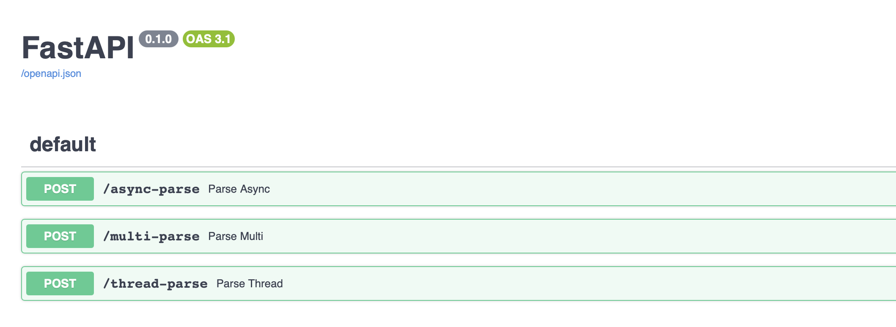
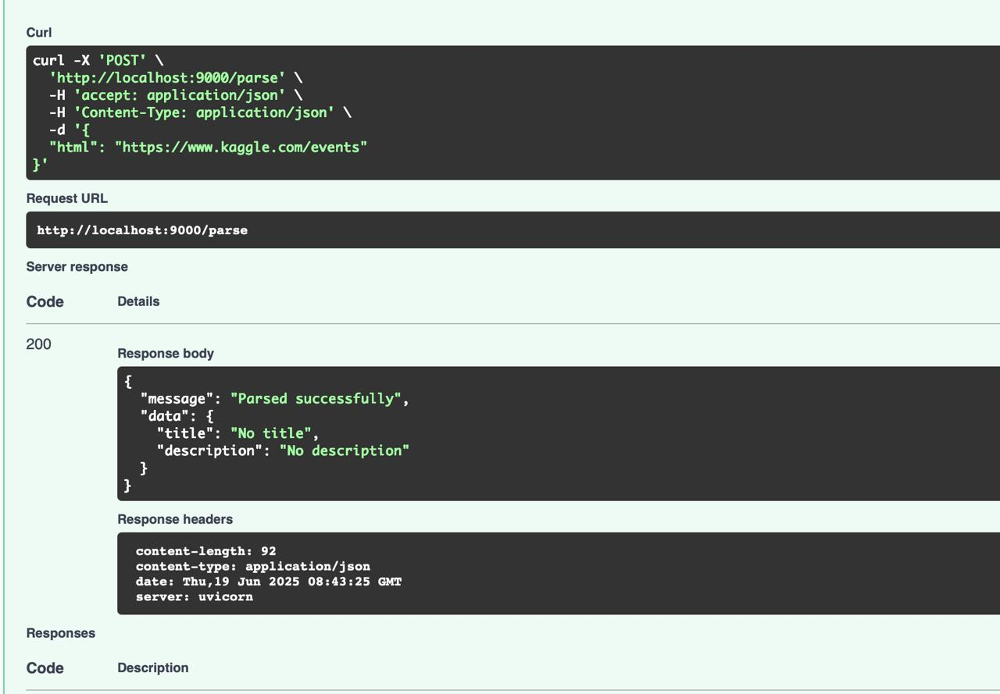
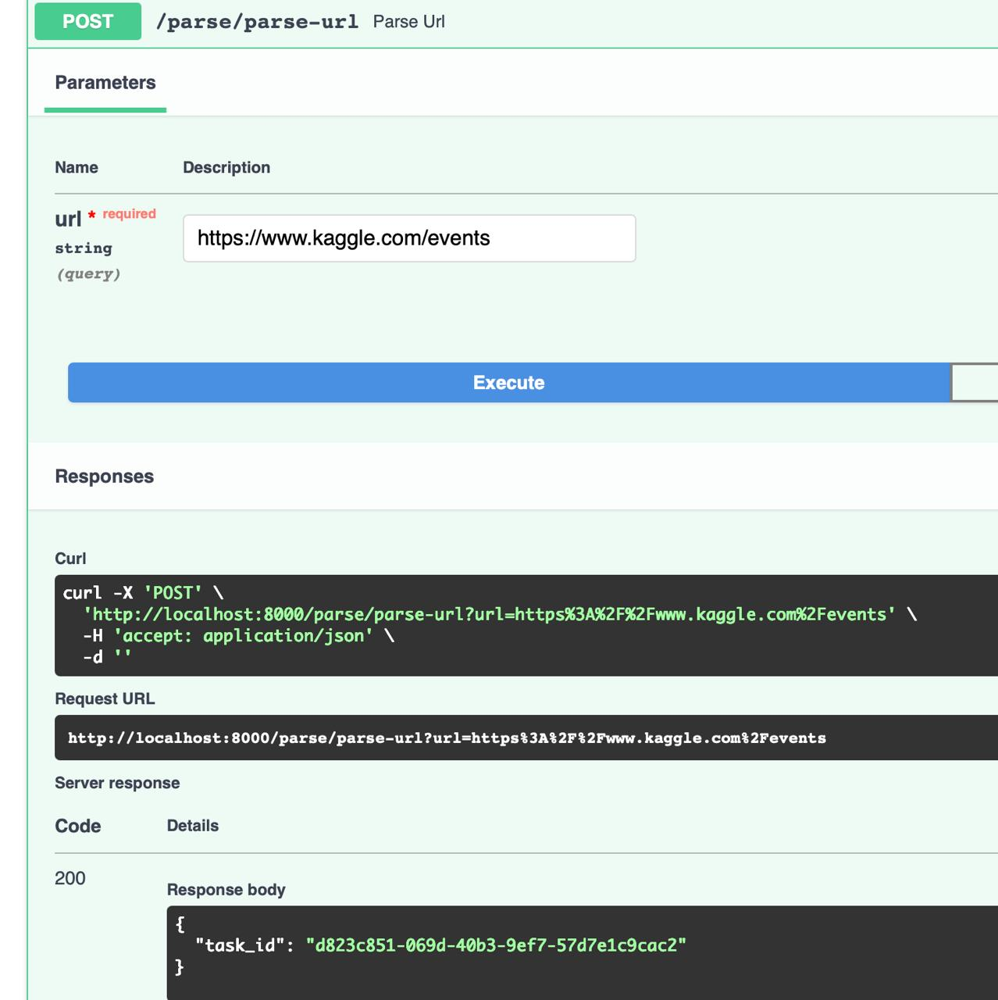
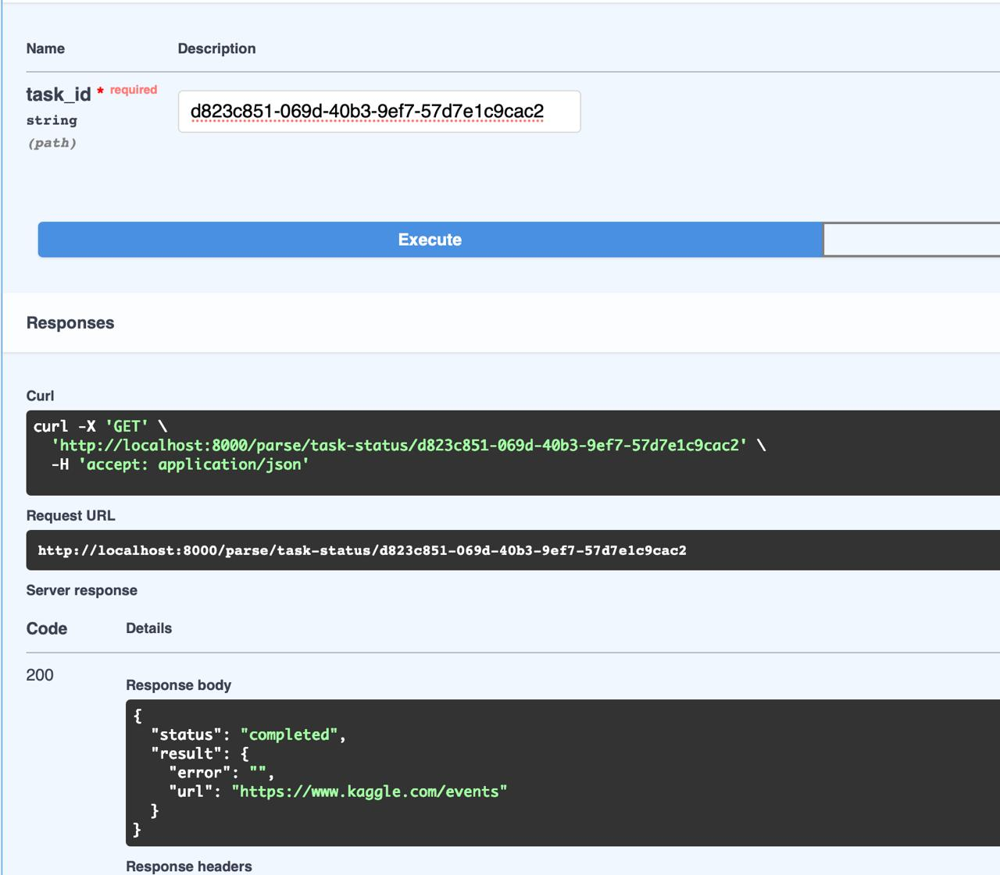

# Лабораторная №3

# Цель

Научиться упаковывать FastAPI приложение в Docker, интегрировать парсер данных с базой данных и вызывать парсер через API и очередь.

1. Создание FastAPI приложения: Создано в рамках лабораторной работы номер 1
2. Создание базы данных: Создано в рамках лабораторной работы номер 1
3. Создание парсера данных: Создано в рамках лабораторной работы номер 2
4. Реулизуйте возможность вызова парсера по http Для этого можно сделать отдельное приложение FastAPI для парсера или воспользоваться библиотекой socket или подобными.
5. Разработка Dockerfile:

Необходимо создать Dockerfile для упаковки FastAPI приложения и приложения с паресером. В Dockerfile указать базовый образ, установить необходимые зависимости, скопировать исходные файлы в контейнер и определить команду для запуска приложения.
Зачем: Docker позволяет упаковать приложение и все его зависимости в единый контейнер, что обеспечивает консистентность среды выполнения и упрощает развертывание.
Полезные ссылки:
FastAPI и Docker-контейнеры
Запускаем PostgreSQL в Docker: от простого к сложному
Документация Dockerfile

6. Создание Docker Compose файла:

Необходимо написать docker-compose.yml для управления оркестром сервисов, включающих FastAPI приложение, базу данных и парсер данных. Определите сервисы, укажите порты и зависимости между сервисами.
Зачем: Docker Compose упрощает управление несколькими контейнерами, позволяя вам запускать и настраивать все сервисы вашего приложения с помощью одного файла конфигурации.
Полезные ссылки:
Зачем нужны системы оркестрации?
Developing a FastAPI Application in a Docker Container
Документация Docker Compose

7. Подзадача 2: Вызов парсера из FastAPI

Эндпоинт в FastAPI для вызова парсера**:
Необходимо добавить в FastAPI приложение ендпоинт, который будет принимать запросы с URL для парсинга от клиента, отправлять запрос парсеру (запущенному в отдельном контейнере) и возвращать ответ с результатом клиенту.
Зачем: Это позволит интегрировать функциональность парсера в ваше веб-приложение, предоставляя возможность пользователям запускать парсинг через API.

docker-compose file

```
version: "3.8"

services:
  db:
    image: postgres:14
    container_name: hackathon_postgres
    restart: always
    environment:
      POSTGRES_USER: postgres
      POSTGRES_PASSWORD: postgres
      POSTGRES_DB: hackathon_db
    ports:
      - "5432:5432"
    volumes:
      - postgres_data:/var/lib/postgresql/data

  redis:
    image: redis:7
    container_name: redis
    restart: always
    ports:
      - "6379:6379"

  hackathon:
    build:
      context: ./hackathon
      dockerfile: Dockerfile
    container_name: hackathon_app
    depends_on:
      - db
      - redis
    env_file:
      - ./hackathon/.env
    ports:
      - "8000:8000"
    volumes:
      - ./hackathon:/app
    command: ["uvicorn", "app:app", "--host", "0.0.0.0", "--port", "8000", "--reload"]

  parser:
    build:
      context: ./parser
      dockerfile: Dockerfile
    container_name: parser_app
    depends_on:
      - db
    env_file:
      - ./parser/task2/.env
    ports:
      - "9000:9000"
    volumes:
      - ./parser:/parser
    command: ["uvicorn", "main:app", "--host", "0.0.0.0", "--port", "9000"]

  celery_worker:
    build:
      context: ./hackathon
      dockerfile: Dockerfile
    container_name: celery_worker
    depends_on:
      - redis
      - hackathon
    command: ["celery", "-A", "celery_worker", "worker", "--loglevel=info"]
    volumes:
      - ./hackathon:/app
    environment:
      - CELERY_BROKER=redis://redis:6379/0
      - CELERY_BACKEND=redis://redis:6379/0

volumes:
  postgres_data:
```








